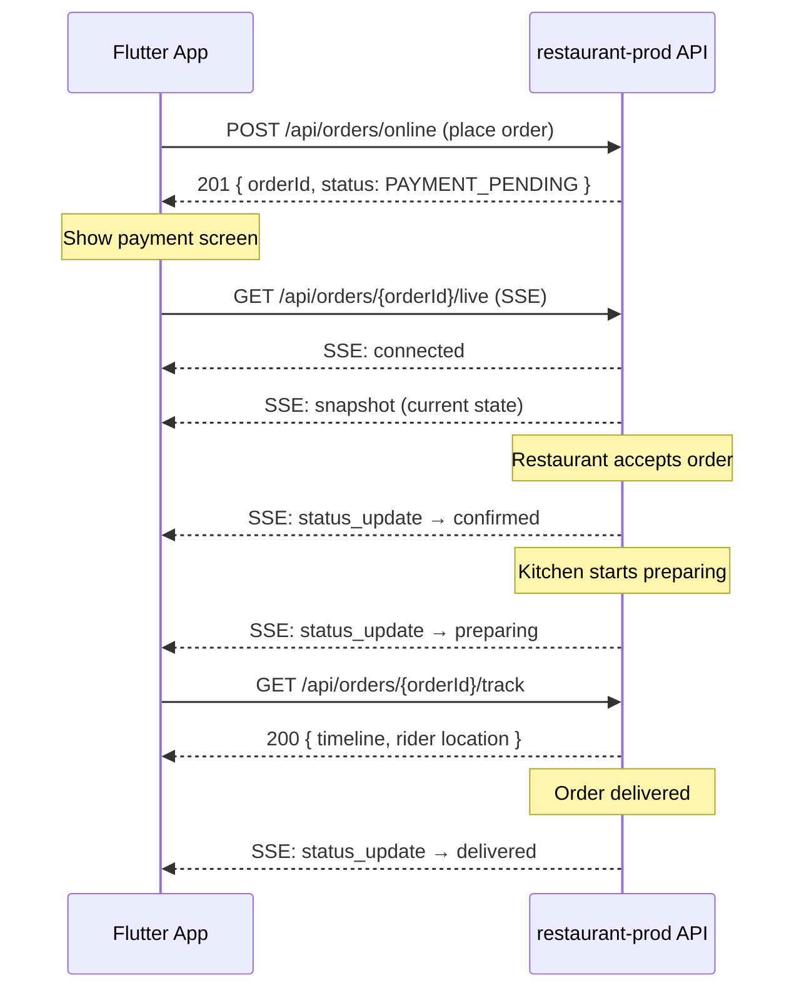

# Online Order API Documentation (Flutter App)

**Base URL:** `https://restaurant-prod.mangaale.com`

All authenticated endpoints require:
```
Authorization: Bearer <JWT_TOKEN>
```

---

## 1. Place Online Order

**`POST /api/orders/online`** (Auth Required)

### Curl

```bash
curl --location 'https://restaurant-prod.mangaale.com/api/orders/online' \
--header 'Authorization: Bearer <JWT_TOKEN>' \
--header 'Content-Type: application/json' \
--data '{
    "restaurantId": 19,
    "orderType": "DELIVERY",
    "customer": {
        "name": "John Doe",
        "phone": "9876543210",
        "email": "john@example.com"
    },
    "deliveryAddress": {
        "street": "123 MG Road",
        "city": "Bangalore",
        "zipCode": "560001"
    },
    "deliveryLatitude": 12.9716,
    "deliveryLongitude": 77.5946,
    "items": [
        {
            "menuItemId": 1426,
            "name": "Sunday special offer",
            "qty": 1,
            "is_taxable": true,
            "unitPrice": 400,
            "totalPrice": 400,
            "variants": [],
            "addons": [],
            "selected_options": [],
            "is_combo": false,
            "combo_items": []
        }
    ],
    "paymentMethod": "upi",
    "instructions": "Please ring the bell",
    "subtotal": 400,
    "taxAmount": 20,
    "cgst": 10,
    "sgst": 10,
    "deliveryFee": 30,
    "tipAmount": 0,
    "discountAmount": 0,
    "totalAmount": 450
}'
```

### Request Body Schema

| Field | Type | Required | Description |
|---|---|---|---|
| `restaurantId` | int64 | ✅ | Restaurant ID |
| `orderType` | string | ❌ | `"DELIVERY"`, `"PICKUP"`, `"DINE_IN"`. Defaults to `"DELIVERY"` |
| `customer.name` | string | ❌ | Customer name |
| `customer.phone` | string | ❌ | Customer phone |
| `customer.email` | string | ❌ | Customer email |
| `deliveryAddress.street` | string | ❌ | Street address (for DELIVERY) |
| `deliveryAddress.city` | string | ❌ | City |
| `deliveryAddress.zipCode` | string | ❌ | ZIP/Postal code |
| `deliveryLatitude` | float64 | ❌ | Delivery latitude |
| `deliveryLongitude` | float64 | ❌ | Delivery longitude |
| `items` | array | ✅ | Array of order items (see below) |
| `paymentMethod` | string | ❌ | `"cash"`, `"upi"`, `"card"`, `"online"` |
| `instructions` | string | ❌ | Special instructions for the order |
| `subtotal` | float64 | ❌ | Subtotal before tax/fees |
| `taxAmount` | float64 | ❌ | Total tax amount |
| `cgst` | float64 | ❌ | Central GST |
| `sgst` | float64 | ❌ | State GST |
| `deliveryFee` | float64 | ❌ | Delivery fee |
| `tipAmount` | float64 | ❌ | Tip amount |
| `discountAmount` | float64 | ❌ | Discount amount |
| `totalAmount` | float64 | ❌ | Final total |
| `discountBreakdown` | object | ❌ | Discount breakdown (see below) |

### Item Schema

| Field | Type | Required | Description |
|---|---|---|---|
| `menuItemId` | int64 | ❌ | Menu item ID from the catalog |
| `name` | string | ✅ | Item name |
| `qty` | int | ✅ | Quantity |
| `is_taxable` | bool | ❌ | Whether item is taxable |
| `unitPrice` | float64 | ✅ | Price per unit |
| `totalPrice` | float64 | ✅ | Total price for this line (qty × unit price + addons) |
| `variants` | array | ❌ | Selected variants (see Variant Schema) |
| `addons` | array | ❌ | Selected addons (see Addon Schema) |
| `selected_options` | array | ❌ | Selected combo choice options |
| `is_combo` | bool | ❌ | Whether this is a combo item |
| `combo_items` | array | ❌ | Combo composition items |

### Variant Schema (inside items)

```json
{
    "variant_id": 101,
    "item_id": 1426,
    "variant_name": "Large",
    "variant_type": "size",
    "price": 500,
    "measurement_unit": "piece",
    "is_available": true,
    "is_default": false
}
```

### Addon Schema (inside items)

```json
{
    "addon_id": 55,
    "addon_name": "Extra Cheese",
    "addon_type": "topping",
    "price": 30,
    "is_available": true
}
```

### Selected Options Schema (for combo items)

```json
{
    "choice_group_id": 1,
    "group_name": "Choose your base",
    "option_id": 5,
    "option_label": "Rice",
    "price_adjustment": 0
}
```

### Combo Items Schema

```json
{
    "menu_item_id": 1427,
    "qty": 1,
    "variant_id": 101
}
```

### Discount Breakdown Schema

```json
{
    "applied_offer_id": "offer_123",
    "applied_offer_name": "10% Off",
    "applied_offer_type": "percentage",
    "applied_offer_discount_amount": 40,
    "standard_discount_name": null,
    "standard_discount_amount": 0,
    "discount_source": "offer",
    "total_discount_amount": 40,
    "spin_discount_amount": 0,
    "spin_result_id": null
}
```

### Success Response (201)

```json
{
    "success": true,
    "data": {
        "orderId": 684,
        "status": "PAYMENT_PENDING",
        "paymentUrl": "https://payment.gateway.com/pay/684"
    }
}
```

### Error Response (400)

```json
{
    "status": "error",
    "statusCode": 400,
    "message": "invalid payload",
    "data": "Key: 'placeOnlineOrderReq.RestaurantID' ..."
}
```

---

## 2. Get Recent Orders

**`GET /api/orders/recent`** (Auth Required)

```bash
curl --location 'https://restaurant-prod.mangaale.com/api/orders/recent' \
--header 'Authorization: Bearer <JWT_TOKEN>'
```

### Success Response (200)

```json
{
    "status": "success",
    "statusCode": 200,
    "message": "recent orders fetched",
    "data": {
        "recent_orders": [
            {
                "order_id": 684,
                "restaurant_name": "iconic",
                "restaurant_logo_url": "https://...",
                "order_status": "pending",
                "total_amount": 450,
                "created_at": "2026-04-25T12:00:00+05:30",
                "items_summary": "Sunday special offer"
            }
        ]
    }
}
```

---

## 3. Get Order History

**`GET /api/orders/history?page=1&limit=10`** (Auth Required)

```bash
curl --location 'https://restaurant-prod.mangaale.com/api/orders/history?page=1&limit=10' \
--header 'Authorization: Bearer <JWT_TOKEN>'
```

---

## 4. Get Order Details

**`GET /api/orders/:orderId`** (Auth Required)

```bash
curl --location 'https://restaurant-prod.mangaale.com/api/orders/684' \
--header 'Authorization: Bearer <JWT_TOKEN>'
```

### Success Response (200)

```json
{
    "status": "success",
    "statusCode": 200,
    "message": "order details fetched",
    "data": {
        "order_id": 684,
        "restaurant_name": "iconic",
        "restaurant_logo_url": "https://...",
        "order_status": "pending",
        "payment_status": "pending",
        "order_type": "DELIVERY",
        "subtotal": 400,
        "tax_amount": 20,
        "cgst": 10,
        "sgst": 10,
        "delivery_fee": 30,
        "tip_amount": 0,
        "discount_amount": 0,
        "total_amount": 450,
        "created_at": "2026-04-25T12:00:00+05:30",
        "items": [
            {
                "menu_item_id": 1426,
                "name": "Sunday special offer",
                "quantity": 1,
                "unit_price": 400,
                "total_price": 400,
                "is_taxable": true,
                "category_type": "offer"
            }
        ]
    }
}
```

---

## 5. Track Order

**`GET /api/orders/:orderId/track`** (Auth Required)

```bash
curl --location 'https://restaurant-prod.mangaale.com/api/orders/684/track' \
--header 'Authorization: Bearer <JWT_TOKEN>'
```

### Success Response (200)

```json
{
    "status": "success",
    "statusCode": 200,
    "message": "tracking info fetched",
    "data": {
        "order_id": 684,
        "order_status": "confirmed",
        "payment_status": "paid",
        "estimated_delivery_time": "2026-04-25T12:45:00+05:30",
        "rider": {
            "latitude": 12.9716,
            "longitude": 77.5946
        },
        "timeline": [
            { "status": "pending", "timestamp": "2026-04-25T12:00:00+05:30" },
            { "status": "confirmed", "timestamp": "2026-04-25T12:05:00+05:30" }
        ]
    }
}
```

---

## 6. Live Order Tracking (SSE)

**`GET /api/orders/:orderId/live`** (Auth Required)

> [!NOTE]
> This is a **Server-Sent Events (SSE)** endpoint. The connection stays open and the server pushes real-time status updates.

```bash
curl --location 'https://restaurant-prod.mangaale.com/api/orders/684/live' \
--header 'Authorization: Bearer <JWT_TOKEN>' \
--header 'Accept: text/event-stream'
```

### SSE Events

```
event: connected
data: {"orderId": 684, "internalOrderId": 684}

event: snapshot
data: {"order_id": 684, "order_status": "confirmed", ...}

event: status_update
data: {"order_id": 684, "status": "preparing", "previous_status": "confirmed", "updated_at": "..."}
```

**Flutter:** Use the `eventsource` or `sse_client` package to consume this.

---

## 7. WebSocket Order Status (Alternative to SSE)

**`WS /ws/orders/status?session_id=<SESSION_ID>&order_id=<ORDER_ID>`**

> [!TIP]
> For QRunch/dine-in orders use WebSocket. For online delivery orders, prefer the SSE endpoint above.

```
wss://restaurant-prod.mangaale.com/ws/orders/status?session_id=123&order_id=684
```

### WebSocket Messages Received

```json
{
    "type": "order_status_updated",
    "order_id": 684,
    "restaurant_id": 19,
    "status": "confirmed",
    "previous_status": "pending",
    "updated_at": "2026-04-25T12:05:00Z",
    "message": "Your order has been confirmed"
}
```

---

## 8. Update Rider Location

**`PUT /api/rider/location`** (Auth Required — Rider role)

```bash
curl --location --request PUT 'https://restaurant-prod.mangaale.com/api/rider/location' \
--header 'Authorization: Bearer <RIDER_JWT_TOKEN>' \
--header 'Content-Type: application/json' \
--data '{
    "latitude": 12.9716,
    "longitude": 77.5946
}'
```

---

## Complete Order Flow (Flutter App)



---

## Order Statuses

| Status | Description |
|---|---|
| `pending` | Order placed, waiting for restaurant |
| `confirmed` | Restaurant accepted the order |
| `preparing` | Kitchen is preparing |
| `ready` | Ready for pickup/delivery |
| `out_for_delivery` | Rider picked up, en route |
| `delivered` | Successfully delivered |
| `completed` | Order completed |
| `cancelled` | Order cancelled |
| `declined` / `rejected` | Restaurant declined the order |

## Payment Statuses

| Status | Description |
|---|---|
| `pending` | Payment not yet made |
| `verification_in_progress` | Payment being verified |
| `paid` | Payment confirmed |
| `failed` | Payment failed |
| `expired` | Payment session expired |
| `refunded` | Payment refunded |

## Order Types

| Value | Description |
|---|---|
| `DELIVERY` | Home delivery |
| `PICKUP` | Customer picks up from restaurant |
| `DINE_IN` | Dine in at restaurant |

## Payment Methods

| Value | Description |
|---|---|
| `cash` | Cash on delivery |
| `upi` | UPI payment |
| `card` | Card payment |
| `online` | Online payment |
